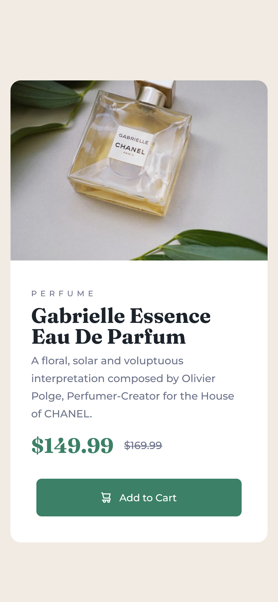

# Frontend Mentor - Product preview card component solution

This is a solution to the [Product preview card component challenge on Frontend Mentor](https://www.frontendmentor.io/challenges/product-preview-card-component-GO7UmttRfa). Frontend Mentor challenges help you improve your coding skills by building realistic projects.

## Table of contents

- [Overview](#overview)
  - [The challenge](#the-challenge)
  - [Screenshot](#screenshot)
  - [Links](#links)
- [My process](#my-process)
  - [Built with](#built-with)
  - [What I learned](#what-i-learned)
  - [Continued development](#continued-development)
  - [Useful resources](#useful-resources)
- [Author](#author)
- [Acknowledgments](#acknowledgments)

## Overview

### The challenge

Users should be able to:

- View the optimal layout depending on their device's screen size
- See hover and focus states for interactive elements

### Screenshot

### Links

- Solution URL: [Add solution URL here](https://github.com/breannataylor/frontendmentor_product_preview_card_component)
- Live Site URL: [Add live site URL here](https://breannataylor.github.io/frontendmentor_product_preview_card_component/)

## My process

### Built with

- Semantic HTML5 markup
- CSS custom properties
- Flexbox
- CSS Grid
- Mobile-first workflow
- Google Fonts

### What I learned

- Media queries: Media queries are the foundation of responsive web development. Before this project I wasn't really familiar with media queries, so my sites were all very much static. Now that I've learned more about media queries, I can make my pages give each user the best user experience - which is sort of the whole point for me.

- Understanding and creating a CSS Reset: A solid CSS reset reduces inconsistencies between different browsers by giving the page it's own defaults for various aspects of the page. I learned a lot about margins, line heights, and font sizes with while creating mine.

- How to add icons with the data attribute: The shopping cart is an icon, and those are small images that aren't necessary in the layout of the page. Originally, I put in a span, but decided to go with a custom data- attribute to keep it out of the site layout.

- Pseudo-classes and functional pseudo-classes: I learned a good bit about action and functional pseudo classes - of course I've used :hover before, but I never really knew what it was technically called. I am not a fan of cumbersome code, and wanted to write my code for :hover, and :focus at the same time - which led me to the is() functional pseudo-class.

### Continued development

I definitely want to continue learning about WCAG and really perfecting my semantic HTML skills so I can develop web apps that aren't just beautiful, but also accessible to as many people as possible.

I also want to really perfect flexbox, grid, and media queries. I know that intuition is honed through praxis, so I am interested in further honing my skills with these particular aspects of design, as I see them as the foundation of well made, responsive websites.

### Useful resources

- WCAG Docs (https://www.w3.org/WAI/WCAG21/Understanding/) - This helped me get my line spacing baseline for my CSS reset. I'm keeping this as a resource in order to keep everything I create accessible to as many as possible.
- MDN Web Docs (https://developer.mozilla.org/en-US/) - I searched this repeatedly! This has quickly become the most used site, it has all the information I need in one easy to find spot. I will say that the language is definitely geared towards someone who is at least slightly versed in developer jargon, but it's still completely approachable material for newbies like me.
- W3 School (https://www.w3schools.org) - I would follow a query on MDN Docs with a similar search here. The MDN was good

## Author

- LinkedIn - [BreAnna Taylor](https://www.linkedin.com/in/breanna-taylor-841468155/)
- Frontend Mentor - [@yourusername](https://www.frontendmentor.io/profile/yourusername)
- Github- [BreAnna Taylor](https://github.com/breannataylor)
